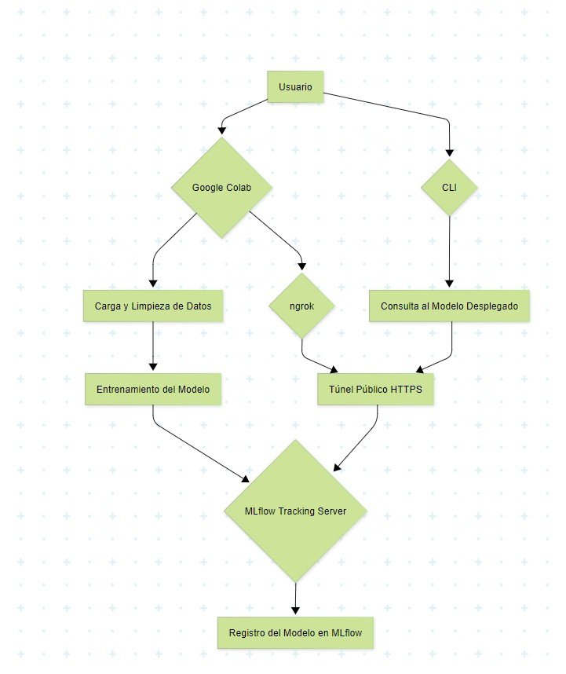

# Despliegue de modelos

## Infraestructura

- **Nombre del modelo:** FakeN
- **Plataforma de despliegue:** Este modelo fue diseñado para desplegarse en un entorno de Google Colab, utilizando MLflow para el seguimiento de experimentos y el registro de modelos, y ngrok para conectar el servidor de MLflow con el libro de colab.
- **Requisitos técnicos:** Bibliotecas:

pandas

numpy

spacy

unidecode

scikit-learn >= 1.6.1

mlflow >= 3.1.4

pyngrok

- **Requisitos de seguridad:** Autenticación: Se requiere un token de autenticación de ngrok para exponer el servidor de MLflow. Este token se debe almacenar en una variable de entorno.
- **Diagrama de arquitectura:** 

## Código de despliegue

- **Archivo principal:** PROYECTO_FAKE_NEWS (Despliegue).ipynb
- **Rutas de acceso a los archivos:** https://github.com/jhonedine/Proyecto_FakeNews/tree/master/scripts/eda
- **Variables de entorno:** NGROK_TOKEN: Token de autenticación de ngrok

## Documentación del despliegue

- **Instrucciones de instalación:**
Instrucciones de instalación:
1. Descargar los archivos del proyecto.
2. Abrir el notebook PROYECTO_FAKE_NEWS (Despliegue).ipynb en Google Colab.
3. Ejecutar la celda que contiene !pip install unidecode y las demás celdas que instalan las bibliotecas necesarias como mlflow y pyngrok.
4. Instalar CLI con la celda !pip install ./src/ para instalar el paquete de la línea de comandos.

- **Instrucciones de configuración:**
1. Obtener un token de autenticación de ngrok:
2. En el notebook, buscar la celda que contiene token = "2zcN7pTW13NM4QkYXT7ub1oi6i6_39ZNFnm5NsrabQHWoVj3r" y reemplazarlo con token propio.
3. Ejecutar la celda y la siguiente (!ngrok authtoken $NGROK_TOKEN) para autenticar ngrok.
4. Iniciar el servidor de MLflow
5. Ejecutar la celda from pyngrok import ngrok; ngrok.connect(5000, "http").
6. Entrenar y registrar el modelo:
7. Ejecutar las celdas siguientes para entrenar el modelo de Regresión Logística y registrarlo en MLflow con el nombre FakeN.

## **Instrucciones de uso:**
1. Ejecutar el comando de git para clonar el repositorio
    !git clone https://github.com/jhonedine/Proyecto_FakeNews
     %cd Proyecto_FakeNews/scripts/evaluation/models/
     !cat Ejecutar_Modelo.py
2. Copiar el contenido de este archivo y copiarlo en la siguiente celda
3. Llamar la función
   predict_fake_news(model)
4. Agregar la noticia a verificar y dar enter

- **Instrucciones de mantenimiento:**
Reentrenamiento del modelo: Este modelo se debe reentrenar periódicamente con nuevos datos, agregandolos desde archivos CSV de noticias falsas y verdaderas etiquetadas y hacer el registro de las versiones en MLflow.
Monitoreo del rendimiento: Para esto se utiliza la interfaz de MLflow para monitorear las métricas de los experimentos de entrenamiento y el accuracy.
Actualización de dependencias: Se debe mantener actualizadas las bibliotecas de Python para asegurar que el modelo funcione correctamente.

